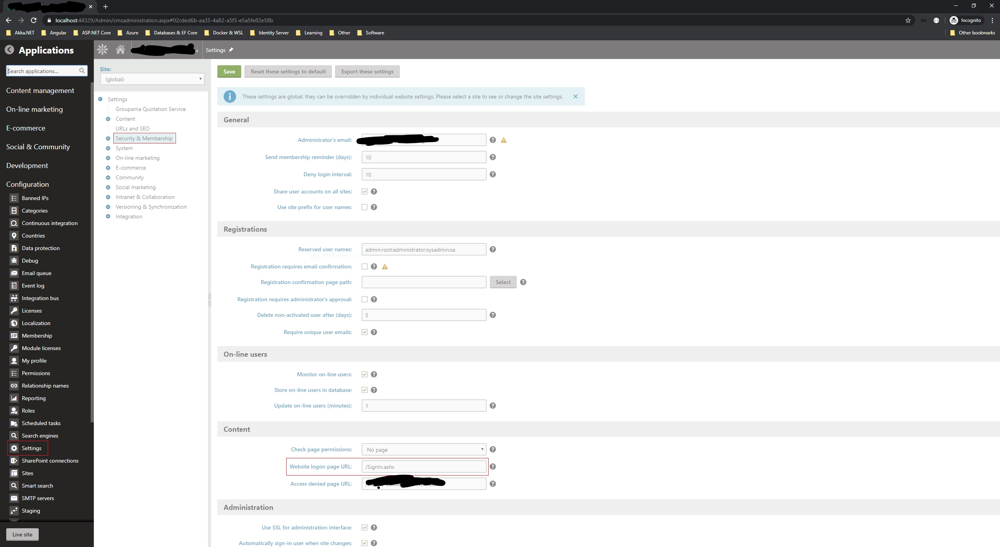

# Indice.Kentico

This repo contains a custom authentication [HTTP Module](https://docs.microsoft.com/en-us/dotnet/api/system.web.ihttpmodule) and coresponding [HTTP handlers](https://docs.microsoft.com/en-us/dotnet/api/system.web.ihttphandler) for Kentico CMS in order to integrate with an OpenID Connect and OAuth 2.0 server, such as IdentityServer4.

## How to use

1. First of all you will have to deactivate (remove or comment out) the forms authentication settings in `system.web` section

```xml
<system.web>
    <!--<authentication mode="Forms">
        <forms loginUrl="CMSPages/logon.aspx" defaultUrl="Default.aspx" name=".ASPXFORMSAUTH" timeout="4320" slidingExpiration="false" />
    </authentication>-->
</system.web>
```

2. Next, you will have to register the custom authentication module and the handlers for sign in, sign out and refresh token.

```xml
<system.webServer>
    <!-- Other settings -->
    <modules>
        <remove name="FormsAuthenticationModule" />
        <add name="OidcAuthenticationModule" type="Indice.Kentico.Oidc.OidcAuthenticationModule" />
    </modules>
    <handlers>
        <add name="SignInHandler" verb="GET" path="SignIn.ashx" type="Indice.Kentico.Oidc.SignInHandler, Indice.Kentico.Oidc" />
        <add name="SignInOidcHandler" verb="POST" path="SignInOidc.ashx" type="Indice.Kentico.Oidc.SignInOidcHandler, Indice.Kentico.Oidc" />
        <add name="RefreshTokenOidcHandler" verb="POST" path="RefreshTokenOidc.ashx" type="Indice.Kentico.Oidc.RefreshTokenOidcHandler, Indice.Kentico.Oidc" />
        <add name="EndSessionOidcHandler" verb="GET" path="SignOut.ashx" type="Indice.Kentico.Oidc.EndSessionOidcHandler, Indice.Kentico.Oidc" />
    </handlers>
    <!-- Probably Other settings -->
</system.webServer>
```

3. In addition you will have to apply some important settings (all are required) in order to communicate with the authority server.

```xml
<configuration>
    <appSettings>
        <!-- Other keys -->
        <add key="Oidc:AutoRedirect" value="false" />
        <add key="Oidc:Authority" value="https://identity.example.com" />
        <add key="Oidc:Host" value="https://example.com" />
        <add key="Oidc:ClientId" value="my_portal" />
        <add key="Oidc:ClientSecret" value="my_strong_secret" />
        <add key="Oidc:Scopes" value="openid offline_access profile api1 api2" />
    </appSettings>
</configuration>
```

4. Finally you will have to set the logon URL to the value of the handler that exists inside our package. 
Open **Configuration** -> **Settings** -> **Security & Membership** and set the `Website logon page URL` field 
(under Content section) and enter the value `/SignIn.ashx` as shown below. If this setting is set, it overrides the `Oidc:AutoRedirect` app setting.

***hint***: The response type that is currently used against the authorization endpoint is `code id_token` (so the `Hybrid flow` is used). The `code id_token` flow would get a `code` and `id_token` in the Authentication Response directly but you'd use the `code` to get an `access_token` from the Token endpoint.
